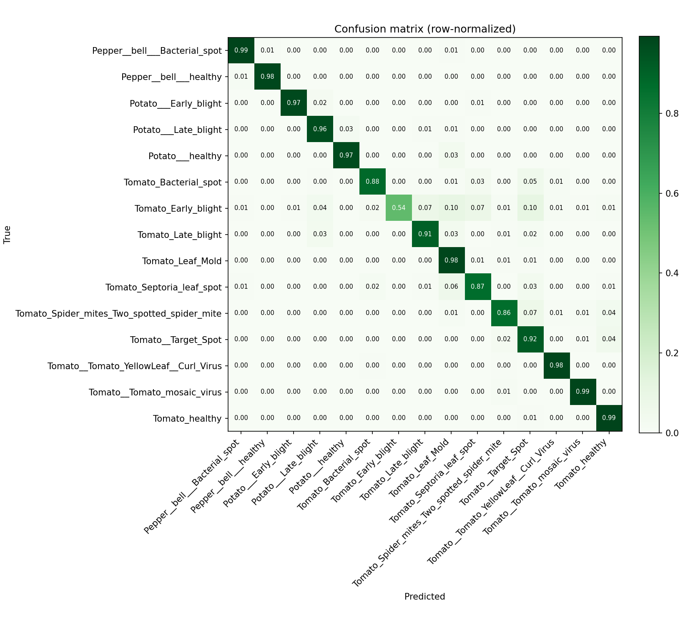

# PlantVillage — Plant Disease Detector

Upload a photo of a plant leaf and get an instant diagnosis (healthy or which disease)
plus simple, AI-generated treatment advice.

This project has three parts:

```
PlantVillage/
├── ml/          # Train the image-classification model (Python + TensorFlow)
├── backend/     # FastAPI service that loads the model and serves /predict
└── frontend/    # Next.js web app where users upload a leaf photo
```

## How it works

1. **Train** an image classifier on the PlantVillage dataset (transfer learning with MobileNetV2) → produces a model file.
2. The **backend** loads that model and exposes a `/predict` endpoint that takes a leaf image and returns the disease + confidence + AI advice.
3. The **frontend** lets a user upload/capture a photo and shows the result nicely.

## Quick start

Build order (recommended): **ml → backend → frontend**

| Part | Folder | How to run |
|------|--------|-----------|
| 1. Train model | `ml/` | See [ml/README.md](ml/README.md) |
| 2. Run API | `backend/` | See [backend/README.md](backend/README.md) |
| 3. Run web app | `frontend/` | `npm install && npm run dev` |

## Tech stack

- **ML:** Python, TensorFlow/Keras, MobileNetV2 (transfer learning)
- **Backend:** FastAPI, Pillow, Groq (for treatment advice)
- **Frontend:** Next.js 14 (App Router), TypeScript, Tailwind CSS

## v1 scope

Start small: train on **one crop** (e.g. tomato) with ~10 classes, get the full
upload → predict → advice flow working end-to-end, then expand to more crops.

## Results

Validation accuracy: **92.0%** (15 classes across 3 crops — Pepper, Potato, Tomato;
4,122 images) · macro-F1 **0.91** · weighted-F1 **0.92**.

Trained in two phases — a frozen-base head, then fine-tuning the top MobileNetV2
layers at a low learning rate — with inverse-frequency **class weighting** so
small classes hold up (e.g. Potato healthy, only 152 images, scores 0.91 F1).
The hardest class is tomato early blight (0.54 recall); it visually overlaps the
other tomato blights and spots.

Per-class precision/recall/F1 and the full metrics are in [`ml/reports/`](ml/reports/).


